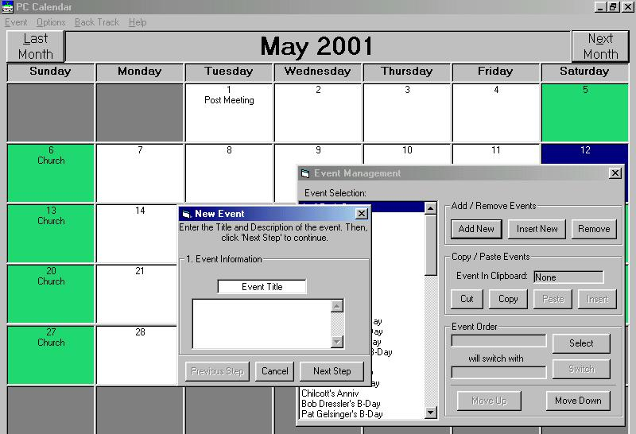



## PC Calendar Pro

### Description

A calendar proogram fully complete with all the works. Keeps track of important dates like birthdays, holidays, etc. It's very useful when you need to remember something important, because every time you log on, you are notified of upcoming events. Includes support for annual, weekly, and even monthly events.

If you want it to pop up every time you log on, you will need to add a Scheduled Task for the program after you compile it.

If you like it, please vote for it. Helpful tips and constructive critizism are welcome.

SEE THE SCREEN SHOT --->
 
### More Info
 

             |
---                |---
**Submitted On**   |2001-05-12 18:29:48
**By**             |[Johnathan Fullman](https://github.com/Planet-Source-Code/PSCIndex/blob/master/ByAuthor/johnathan-fullman.md)
**Level**          |Advanced
**User Rating**    |4.5 (77 globes from 17 users)
**Compatibility**  |VB 6\.0
**Category**       |[Math/ Dates](https://github.com/Planet-Source-Code/PSCIndex/blob/master/ByCategory/math-dates__1-37.md)
**World**          |[Visual Basic](https://github.com/Planet-Source-Code/PSCIndex/blob/master/ByWorld/visual-basic.md)
**Archive File**   |[PC Calenda197355172001\.zip](https://github.com/Planet-Source-Code/johnathan-fullman-pc-calendar-pro__1-23252/archive/master.zip)

